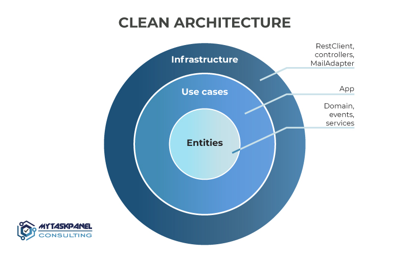

# go-clean-tx

Go Clean Architecture with transaction

## Todo

- [x] Clean architecture
- [x] Clean transaction

## Run

```shell
go generate ./...
```

```shell
go test ./...
```

```shell
go run ./cmd/http
```

## Architecture



Source: [MyTaskPanel Consulting](https://www.mytaskpanel.com)

## Structure

### A typical top-level directory layout

```
.
├── cmd                                 # Main applications
├── internal                            # Private application and library code
├── pkg                                 # Library code that's ok to use by external applications
├── go.mod
├── go.sum
├── LICENSE
└── README.md
```

### Private application and library code

```
.
├── ...
├── internal
│   ├── domain                          # Domain: entity, data model, domain services, interfaces
│   ├── port                            # Port: interface for communicating between layers
│   │   └── mock
│   ├── infrastructure                  # External elements with which the application communicates, both input and output
│   │   ├── http                        # Entry point: an API with REST or GraphQL, messaging with RabbitMQ or via the command line, etc.
│   │   │   ├── gin
│   │   │   └── presenter
│   │   └── repo                        # Exit point: a relational database with PostgreSQL, non-relational with MongoDB, or also sending messages with RabbitMQ, etc.
│   │       ├── memory
│   │       └── database
│   └── usecase                         # Business logic happens here
└── ...
```

## References

- [bxcodec/go-clean-arch](https://github.com/bxcodec/go-clean-arch)
- [golang-standards/project-layout](https://github.com/golang-standards/project-layout)
- [Why use a Clean Architecture: parts, principles and advantages | MyTaskPanel Consulting](https://www.mytaskpanel.com/the-5-advantages-of-using-a-clean-architecture-all-you-need-to-know)
- [Clean Transactions in Golang Hexagon | Ilya Kaznacheev](https://www.kaznacheev.me/posts/en/clean-transactions-in-hexagon)
